# SinGAN: Learning a Generative Model from a Single Natural Image
Pytorch implementation of "SinGAN: Learning a Generative Model from a Single Natural Image" 
([arxiv](https://arxiv.org/abs/1905.01164))

>> Official repository : [SinGAN Official Pytorch implementation](https://github.com/tamarott/SinGAN)

This implementation is based on these repos.
* [Pytorch Official ImageNet Example](https://github.com/pytorch/examples/tree/master/imagenet)
* [Official Repository of " Which Training Methods for GANs do actually Converge?"](https://github.com/LMescheder/GAN_stability)

## NOTE
This repository is not official implementation. The official one is here : [SinGAN Official Pytorch implementation](https://github.com/tamarott/SinGAN).


## Abstract
We introduce SinGAN, an unconditional generative
model that can be learned from a single natural image.
Our model is trained to capture the internal distribution of
patches within the image, and is then able to generate high
quality, diverse samples that carry the same visual content
as the image. SinGAN contains a pyramid of fully convolu-
tional GANs, each responsible for learning the patch distri-
bution at a different scale of the image. This allows generat-
ing new samples of arbitrary size and aspect ratio, that have
significant variability, yet maintain both the global struc-
ture and the fine textures of the training image. In contrast
to previous single image GAN schemes, our approach is not
limited to texture images, and is not conditional (i.e. it gen-
erates samples from noise). User studies confirm that the
generated samples are commonly confused to be real im-
ages. We illustrate the utility of SinGAN in a wide range of
image manipulation tasks.

## Todo
- [X] Multi-scale GAN with progression
- [X] Initialization via copy
- [X] Scaling noise by the root mean square error between input image and reconstructed one
- [X] Zero padding at the image level (not feature level)
- [X] WGAN-GP loss

### Additional implementation for better quality
- [X] LSGAN loss
- [X] Non-saturating loss with zero-centered gradient penalty

## Notes
  * GAN with Zero-centered GP and larger weight of reconstruction loss exhibits better quality.
  * Inter-run variance is large
## Requirement
  * python 3.6
  * pytorch 1.0.0 or 1.1.0
  * torchvision 0.2.2 or 0.3.0
  * tqdm
  * scipy
  * PIL
  * opencv-python (cv2)
  
## Data Preparation
### THIS PROCESS IS IMPORTANT. Many people make a mistake with the directory of dataset. IF YOU'VE GOT A ERROR "out of index", PLEASE CHECK THE DIRECTORY AGAIN.
  * Download "monet2photo" dataset from https://people.eecs.berkeley.edu/~taesung_park/CycleGAN/datasets/
  * Extract and rename "trainB" and "testB" to "trainPhoto" and "testPhoto", respectively. Then, place "trainPhoto" and "testPhoto" in "SinGANdata" folder

  * Example directory hierarchy :
  ```
  Project
  |--- data
  |    |--- SinGANdata
  |             |--- trainPhoto
  |             |--- testPhoto
  |--- SinGAN
       |--- code
             |--- models
             |        |--- generator.py
             |        |--- ...
             |--- main.py 
             |--- train.py
             | ...
       
  ```
   * Then, an image in "trainPhoto" will be selected randomly for training.
   
## How to Run
### Arguments
   * data_dir
       * Path of dataset. If you follow the example hierarchy, let it default.
   * dataset
       * Dataset to use. It is fixed to "PHOTO".
   * gantype
       * Loss type of GANs. You can choose among "wgangp, zerogp, lsgan". Recommend to use "zerogp".
   * model_name
       * Prefix of the directory of log files.
   * workers
       * Workers to use for loading dataset.
   * batch_size
       * Size of batch, it is fixed to "1". SinGAN uses only one image.
   * val_batch
       * Size of batch in validation, it is fixed to "1". SinGAN uses only one image.
   * img_size_max
       * Size of largest image. = Finest
   * img_size_min
       * Size of smallest image. = Coarsest
   * img_to_use
       * Index of the image to use. If you do not change, it will be sampled randomly.
   * load_model
       * Directory of the model to load.
   * validation
       * If you call, the code will go into the validation mode.
   * test
       * If you call, the code will go into the test mode. But, it is the same as validation essentially.
   * world-size
       * Do not change.
   * rank
       * Do not change.
   * gpu
       * GPU number to use. You should set. Unless it utilizes all the available GPUs.
   * multiprocessing-distributed
       * Do not use in this setting.
   * port
       * Do not use in the setting.

SinGAN uses only one image to train and test. Therefore multi-gpus mode is not supported.
   
### Train
   * Use NS loss with zero-cented GP and 0-th gpu. The train image will be selected randomly. It will generate (1052, 1052) images at last.
```
python main.py --gpu 0 --gantype zerogp --img_size_max 1025
```
   * Use WGAN-GP loss to train and 0-th gpu.
```
python main.py --gpu 0 --img_to_use 0 --img_size_max 1025 --gantype wgangp
```
### Test
```
python main.py --gpu 0 --img_to_use 0 --img_size_max 1025 --gantype zerogp --validation --load_model $(dir)
```

   * Running the script in "Train" stores the intermediate results automatically. So, you do not need to run "Test".
   
## Results
   * Thunder image is from : [Google](https://www.google.com/search?q=%EB%B2%88%EA%B0%9C+%EC%82%AC%EC%A7%84&newwindow=1&source=lnms&tbm=isch&sa=X&ved=0ahUKEwiHq56y98DjAhVpwosBHUk7B4UQ_AUIESgB&biw=1855&bih=952#imgrc=WRuGDsKOTh9ShM:)
   * Original / Reconstructed / Generated (33, 59, 105, 187 px)  
       
    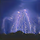   
       
       
  
   * More generation results 
      * 187px / Last two images are recon/real, respectively.  
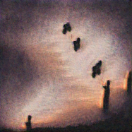 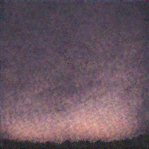   
   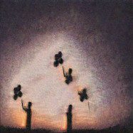 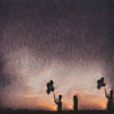 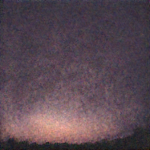  
   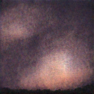 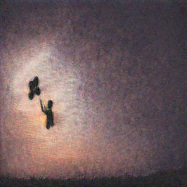 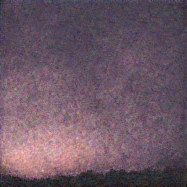  
   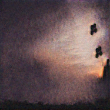 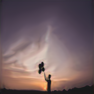   
      * 187px / Recon. image and real one are placed among fakes.  
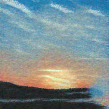 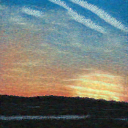 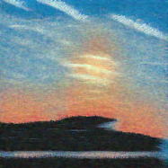  
   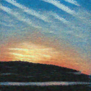 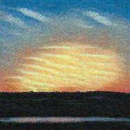 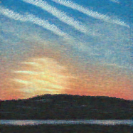  
   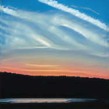 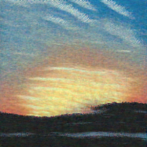 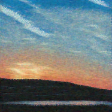  
   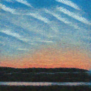    
      * 247px  
   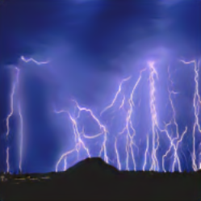 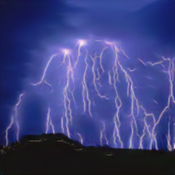 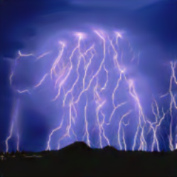  
   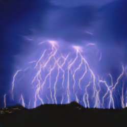 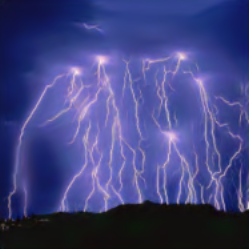 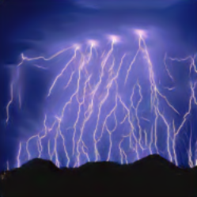  
    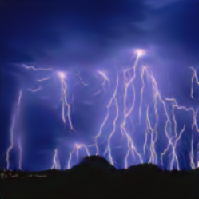 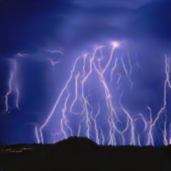  
   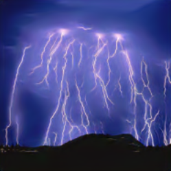 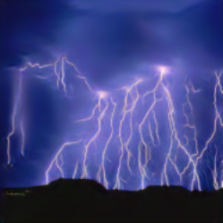 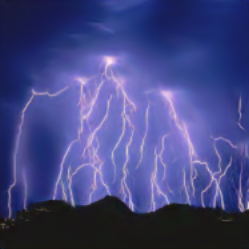  
      * 591px  
   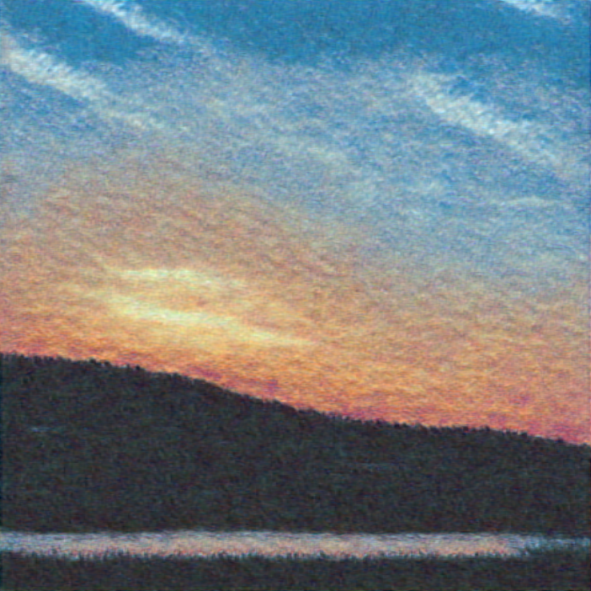 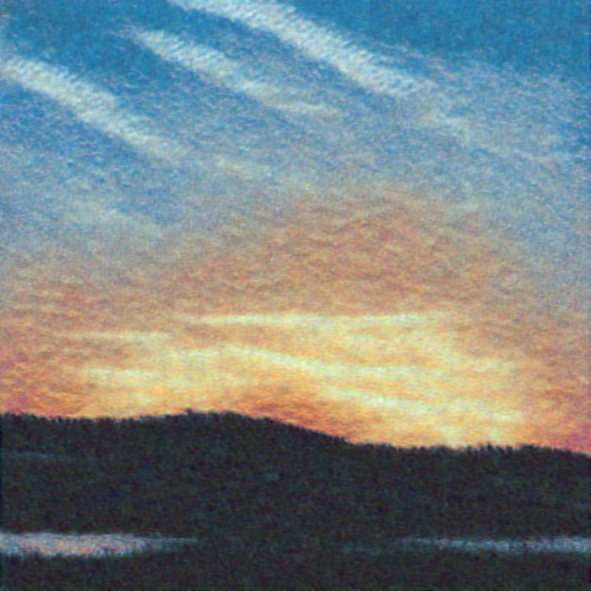  
   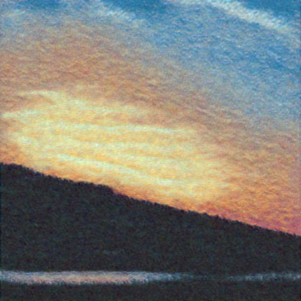 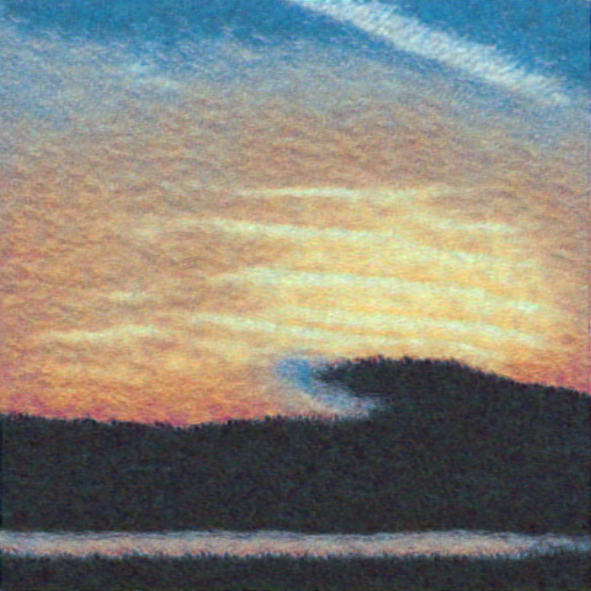  
   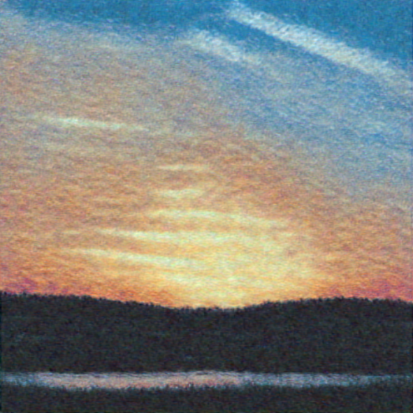   
## References
   * Shaham, Tamar Rott, Tali Dekel, and Tomer Michaeli. "SinGAN: Learning a Generative Model from a Single Natural Image." arXiv preprint arXiv:1905.01164 (2019).
   * Gulrajani, Ishaan, et al. "Improved training of wasserstein gans." Advances in neural information processing systems. 2017.
   * Mescheder, Lars, Andreas Geiger, and Sebastian Nowozin. "Which training methods for GANs do actually converge?." arXiv preprint arXiv:1801.04406 (2018).
   * Zhu, Jun-Yan, et al. "Unpaired image-to-image translation using cycle-consistent adversarial networks." Proceedings of the IEEE international conference on computer vision. 2017.
